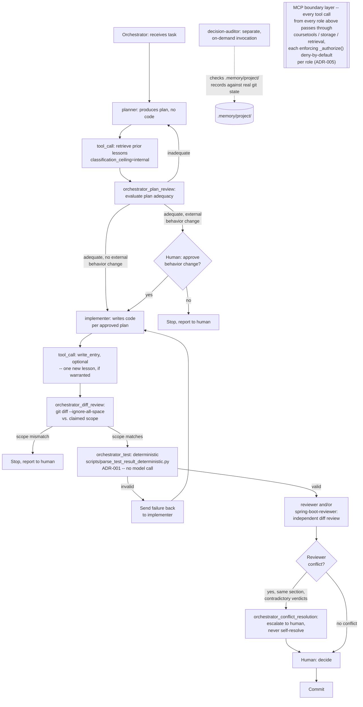

# Orchestration Diagram

## Reading this diagram

- **Deterministic step, explicitly marked:** `orchestrator_test` makes no model call at all -- it runs a script (`scripts/parse_test_result_deterministic.py`) that parses Maven's own test-result summary line directly. This step was agentic through Module 4.2; ADR-001 documents the conversion, with measured before/after evidence.
- **Two distinct orchestrator review points**, not one generic "review" step: `orchestrator_plan_review` (before any code exists) and `orchestrator_diff_review` (after implementation, checking the actual diff against the approved scope). Each can send work back rather than proceeding.
- **Human checkpoints have explicit trigger criteria**, not a blanket "ask every time": one fires specifically when a plan proposes an externally-visible behavior change; the unconditional one fires before every commit regardless of how the run went; a third fires only when two reviewers genuinely disagree on the same section (never self-resolved by the Orchestrator).
- **`decision-auditor` is not part of the main plan-implement-review sequence.** It's a separately-invoked role, checking existing `.memory/project/` records against real git state on its own schedule, not a step every task passes through.
- **The MCP boundary layer is cross-cutting, not a single step in the sequence.** Every tool call any role above makes -- `planner`'s `retrieve`, `implementer`'s `write_entry`, `decision-auditor`'s scoped file access -- passes through one of three MCP servers, each independently enforcing a deny-by-default allow-list keyed on the calling role (ADR-005). This is what actually stops an out-of-scope action, not the diagram's own sequencing.

## Implementing this from scratch

A reader implementing this design needs: the role definitions and their tool grants (`docs/routing-and-tool-grant-map.md`), the per-role policy with denial justifications (`docs/governance-policy.md`), the Orchestrator's own instructions for when to invoke each step and what to do on failure (`CLAUDE.md`), and the three MCP servers' real enforcement code (`mcp-servers/*/server.py`, each with its own `allow-list.json`). No step in this diagram requires global tool access -- every arrow corresponds to a specific, named grant in the routing map.
