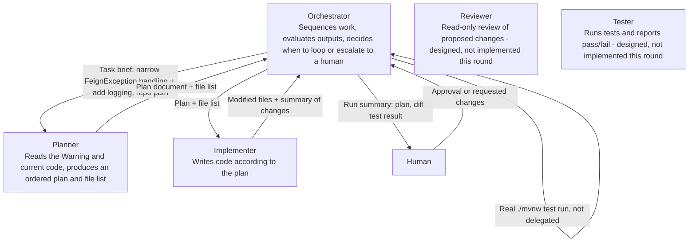

# Orchestration Diagram - FeignException Narrowing Workflow

This file uses Mermaid because GitHub renders Mermaid diagrams directly inside Markdown.

## Handoff summary

1. The Orchestrator invokes the `planner` with the task brief (the `spring-boot-reviewer` Warning text) and the repository path.
2. The Orchestrator evaluates the plan: does it correctly distinguish a genuine unreachable-service failure (timeout, connection refused, 5xx) from other non-404 errors, and does it specify where logging goes? If not, it sends the plan back to the Planner with specific feedback and requests a revision before proceeding -- it does not pass an inadequate plan to the Implementer.
3. Once the plan is adequate, the Orchestrator sends the plan and file list to the `implementer`.
4. The Orchestrator evaluates the Implementer's output by running a real `./mvnw test` itself (not delegated to a Tester subagent this round, since Tester is designed but not implemented). If the build fails, the Orchestrator sends the failure output back to the Implementer and requests a fix, rather than proceeding.
5. Once tests pass, the Orchestrator assembles a run summary (plan, diff, test result) and presents it to a human for approval before the change is committed. This is the required human checkpoint -- no code from this workflow is committed without it.
6. `reviewer` and `tester` are fully designed (see the routing-and-tool-grant map) but not implemented as runnable agents this round; the Orchestrator's own test run stands in for Tester, and human review at the approval step stands in for Reviewer.
